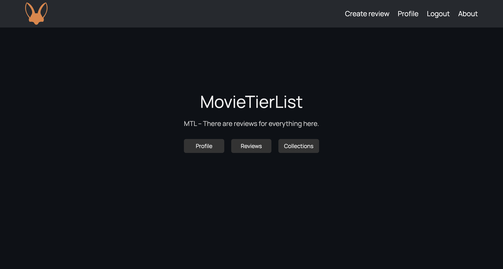
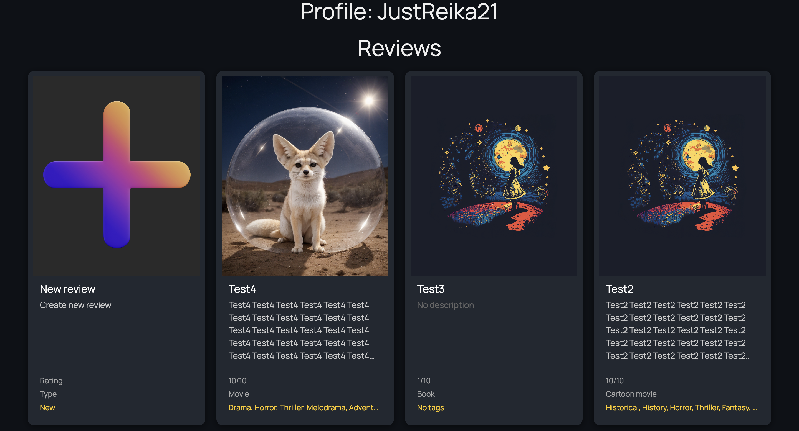
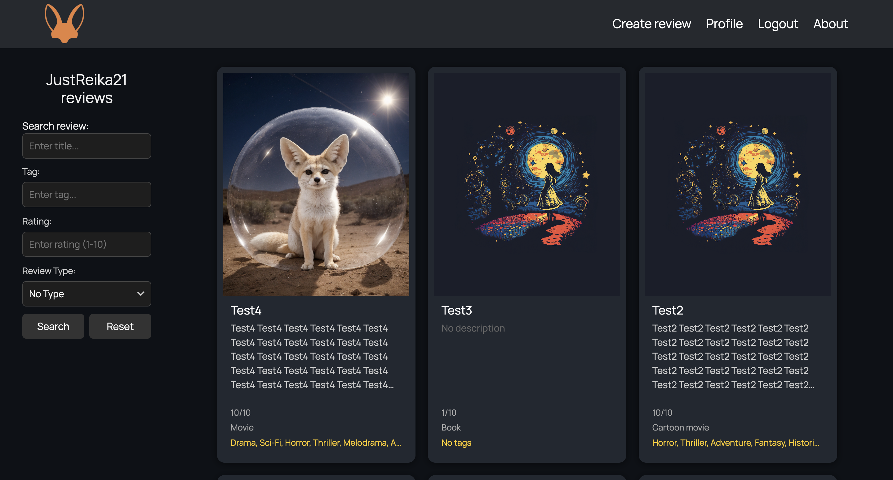
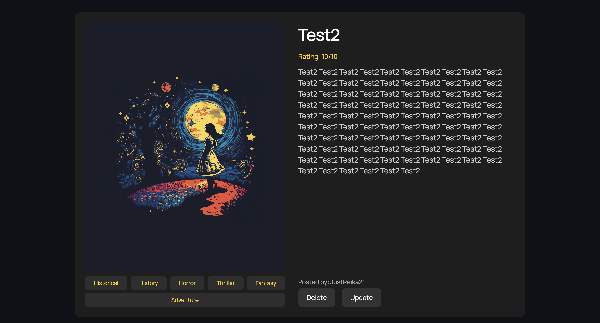
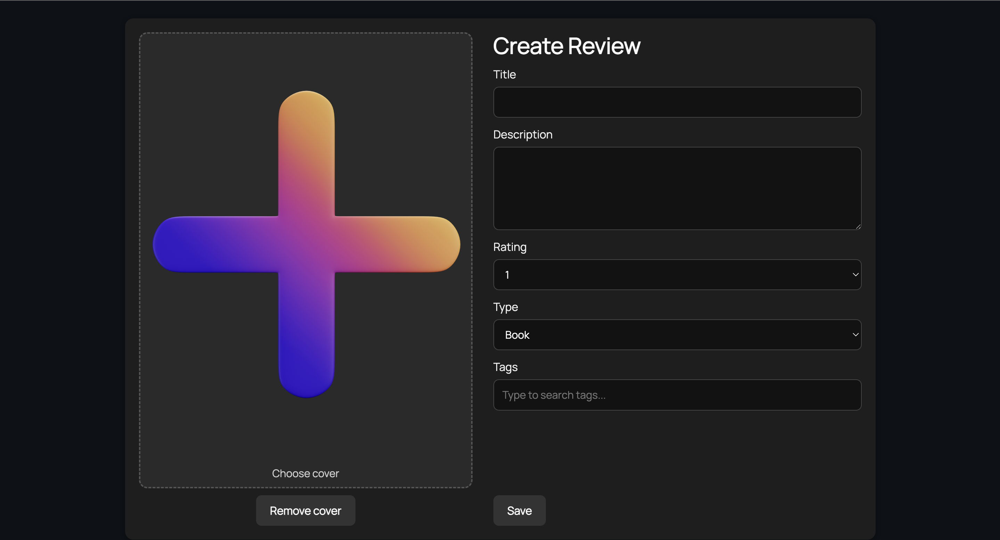
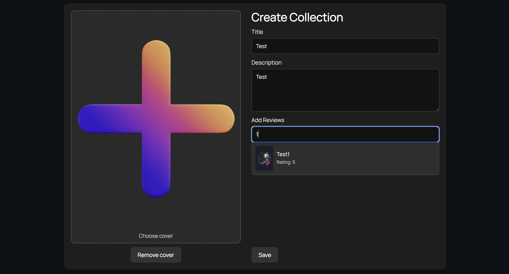

# 🎬 MovieTierList

Платформа для создания обзоров на фильмы, игры, книги, сериалы, аниме и любое другое творчество. Пользователи могут публиковать обзоры и объединять их в коллекции.

---

## 🚀 Функционал

* Регистрация и авторизация пользователей
* Создание обзоров на различные произведения
* Создание коллекций с обзорами
* REST API (Django Rest Framework)
* Документация API через Swagger и Redoc
* Тестирование с помощью pytest

---

## 🛠️ Стек технологий

* Python
* Django
* Django Rest Framework
* PostgreSQL
* pytest
* Swagger + drf-spectacular
* Docker
* HTML, CSS, JavaScript

---

## ⚙️ Установка и запуск

### 1. Клонирование репозитория

```bash
git clone https://github.com/JustReika21/MovieTierList.git
```

### 2. Настройка переменных окружения

Создайте файл `.env` в корне проекта и заполните его по примеру `.env.example`:

### 3. Запуск через Docker

```bash
docker compose up --build
```

## 📄 API документация

* Swagger UI: [http://localhost:8000/api/schema/swagger-ui/](http://localhost:8000/api/schema/swagger-ui/)
* Redoc: [http://localhost:8000/api/schema/redoc/](http://localhost:8000/api/schema/redoc/)

---

## 🧪 Тестирование

```bash
docker-compose exec -it django_movie pytest
```

## Главная страница


## Обзоры в профиле


## Все обзоры


## Пример обзора


## Создание обзора


## Создание коллекции

